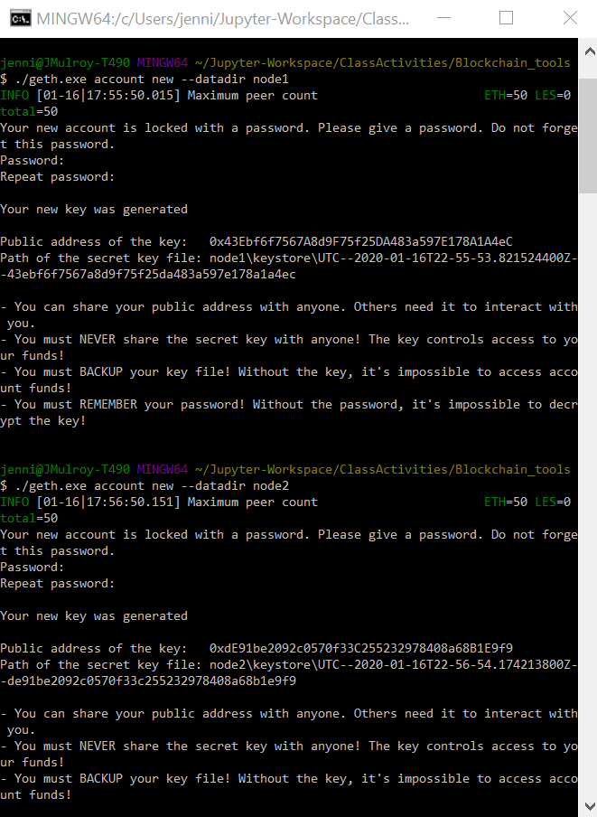

# 18-Blockchain Proof of Authority Development Chain

For this assignment, I am taking the role of a new developer at Zbank, a small, innovative bank, that is interested in exploring what blockchain technology can do for them and their customers. My first project at the company is to set up a private testnet with a team of developers to explore potentials for blockchain at ZBank.

By setting up a testnet, there is no real money involved, which will give our team the freedom to experiment. Testnets allows for offline development. 

To set up a testnet, I will need to use the following skills/tools:

- `Puppeth` tool to generate the genesis block

- `Geth` a command-line tool, to create keys, initialize nodes, and connect the nodes together

- The Clique Proof of Authority algorithm

Tokens inherently have no value here, so pre-configured accounts and nodes for easy setup will be provided as well as documentation.

## Blockchain Consensus Algorithms

Blockchain is a time-stamped series of immutable records of data managed by a clusters of computers and not owned by any single entity or government. Each block of data is secured and bound using cryptographic principles, a 'chain'.  The blockchain network has no central authority, it is a shared and immutable ledger. It is very transparent and all involved are held accountable.

A consensus algorithm determines the validity of transactions; a way in which the network reaches consensus as there is no central authority. The alogorithms ensure the correct protocol rules are being followed and network participants agree on the current state of the Blockchain without oversight. 

There are currently three consensus algorithms, Proof of Work (PoW), Proof of Stake (PoS), and Proof of Authority (PoA). PoA is used in this assignment. 

*Proof of Work*: Bitcoin uses PoW, it selects a miner for the next block generation. The miner is tasked with a complex mathematical puzzle that requires a lot of computation power and if solves the puzzle get to mine the next block. 

*Proof of Authority* : Proof of Authority is reputation-based, assigning approved validators with the task of verifying blocks enables. Validators have incentives to act ethically. 

*Proof of Stake*: In Proof of Stake, validators invest in the coins of the system, unlocking their coins as stake. After that, all the validators will start validating the blocks. Validators will validate blocks by placing a bet on it if they discover a block which they think can be added to the chain. Based on the actual blocks added in the Blockchain, all the validators get a reward proportionate to their bets and their stake increase accordingly.


## Blockchain and Ethereum Tools Installation Guide

To get started building blockchain, software tools and utilities need to be installed and environments configured. 

1. **Important Note:** Windows users **MUST** use `git-bash` and not the default Windows command prompt. 

2. [MyCrypto](https://www.mycrypto.com/) is a free, open-source, client-side interface that allows direct interaction with blockchain. MyCrypto Desktop App will be used to manage ethereum wallets and make transactions in the blockchain. To install, navigate to the downloads page at https://download.mycrypto.com/. 

3. [Go Ethereum](https://geth.ethereum.org/) is one of the three original implementations (along with C++ and Python) of the Ethereum protocol. It is written in Go, fully open source and licensed under the GNU LGPL v3. Go Ethereum Tools will be used to create the blockchain, including the genesis block, mining tokens and making transactions. Navigate to the Go Ethereum Tools download page at https://geth.ethereum.org/downloads/. 

##  Instructions for Proof of Authority Blockchain Transactions

###  Creating Nodes

Open GitBash in Windows and navigate to `Blockchain-Tools` folder to run all commands: 

1. Create an empty directory for nodes 
```
mkdir node1 node2
```
2. Get new accounts numbers from nodes to use as signers
```bash
./geth account new --datadir node1
./geth account new --datadir node2
```


## Running Puppeth

Puppeth is an Ethereum private network manager that is accessed through a command line wizard. The tool creates a new Ethereum network, including the genesis block, bootnodes, and miners. Puppeth uses SSH to dial into remote servers, and builds its network components out of docker containers using docker-compose.

1. Initiate `puppeth.exe`
  ```
  ./puppeth
  ```
2. Specify unique network name: `>zbankcoinz`

3. Type `2` to pick the `Configure new genesis` option, then `1` to `Create new genesis from scratch`

4. Type `2` to choose `Proof of Authority` 

5. Paste the public address of the nodes created for the accounts allowed to seal. 

6. Use the same addresses for accounts that should be pre-funded 

7. Select `yes` to the prompt if the precompile-addresses (0x1 .. 0xff) be pre-funded with 1 wei

8. Determine a four number combination to create a "chain ID"

9. Type `2`, `Manage existing genesis` 

10. Next, type `2` again to choose the `Export genesis configurations` option, then continue with the default (current) directory:

11. This should generate json files in the Blockchain-Tools folder

12. Exit the puppeth prompt by using the Ctrl+C keys combination.
